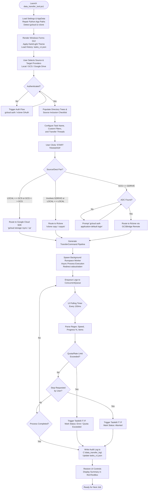

# Data Transfer Tool (`data_transfer_tool.ps1`)

> **NOAA Scientific Product Disclaimer**
> 
> *This repository is a scientific product and is not official communication of the National Oceanic and Atmospheric Administration, or the United States Department of Commerce. All NOAA GitHub project code is provided on an ‘as is’ basis and the user assumes responsibility for its use. Any claims against the Department of Commerce or Department of Commerce bureaus stemming from the use of this GitHub project will be governed by all applicable Federal law. Any reference to specific commercial products, processes, or services by service mark, trademark, manufacturer, or otherwise, does not constitute or imply their endorsement, recommendation or favoring by the Department of Commerce. The Department of Commerce seal and logo, or the seal and logo of a DOC bureau, shall not be used in any manner to imply endorsement of any commercial product or activity by DOC or the United States Government.*

---

## Overview

The **Data Transfer Tool** is an enterprise-grade PowerShell Windows Forms GUI application designed for reliable, high-throughput, and observable data migration across heterogeneous storage environments. It provides unified orchestration across:

* **Local Storage** (Local disks, mapped drives, and UNC network shares)
* **Google Cloud Storage (GCS)** (Standard/multi-region buckets, project-managed or direct bucket access)
* **Google Drive** (Personal "My Drive" and Enterprise "Shared Drives" / Team Drives)

The tool dynamically routes transfer jobs between two industry-standard transfer engines: the **Google Cloud SDK (`gcloud storage`)** engine for native Google Cloud transfers, and the **Rclone (`rclone.exe`)** engine for Google Workspace and cross-cloud bridging. Transfer operations execute asynchronously within isolated PowerShell runspaces to ensure real-time UI responsiveness, live log streaming, automatic circuit breaking on API quota exhaustion, and persistent audit trail recording.

---

## 1. System Architecture & Detailed Workflow

### 1.1 Architectural Overview

```
+---------------------------------------------------------------------------------------+
|                                    GUI Main Thread                                    |
|  +---------------------+   +------------------------------------+   +---------------+ |
|  | Task History List   |   | Source & Target Storage Browsers   |   | Live Logs &   | |
|  | (ListView / JSON DB |   | - Provider Select (GCS/Drive/Local)|   | RichTextBox   | |
|  |  Sync)              |   | - Project / Bucket / Drive Pickers |   | - Syntax Color| |
|  |                     |   | - Inclusion Checklist (Check/Unchk)|   | - Progress Bar| |
|  +---------------------+   +------------------------------------+   +---------------+ |
|                                       ^                                       ^       |
|                                       | (150ms Timer Updates)                 |       |
|                                       +------------------+                    |       |
+----------------------------------------------------------|--------------------|-------+
                                                           |                    |
                                     +---------------------+                    |
                                     | ConcurrentQueue<LogEntry>                |
                                     |                                          |
+-------------------------------------------------------------------------------+-------+
|                               Background Runspace Worker                              |
|                                                                                       |
|  +-------------------------+     Execution Routing      +--------------------------+  |
|  | Native Cloud Engine     | <=======================>  | Rclone Engine            |  |
|  | `gcloud storage rsync`  |    (Engine Selection)      | `rclone copy / copyto`   |  |
|  | `gcloud storage cp`     |                            | Multi-thread & Pacer     |  |
|  +-------------------------+                            +--------------------------+  |
|               |                                                       |               |
|               +---------------------------+---------------------------+               |
|                                           |                                           |
|                            Standard I/O Redirection & Parser                          |
|                            (Regex Metrics & 403 Circuit Breaker)                      |
+---------------------------------------------------------------------------------------+
```

### 1.2 Step-by-Step Operational Lifecycle

1. **System Environment & Remediation (`Load-Settings`, `Set-RcloneEnvironment`, `Set-GCloudEnvironment`)**:
   * Inspects Windows Registry (`HKCU:\Software\Microsoft\Windows\CurrentVersion\App Paths\python.exe` and `python3.exe`) and removes legacy default overrides to prevent conflicts with Google Cloud SDK's internal bundled Python environment (`platform\bundledpython\python.exe`).
   * Loads or creates persistent configuration in `$env:APPDATA\DataTransferTool\settings.json`.
   * Resolves paths for `rclone.exe` and `gcloud.cmd` by checking user settings, application directory (`$PSScriptRoot`), and system `PATH`.
   * Generates or validates `$env:APPDATA\DataTransferTool\rclone_persistent.conf` containing the auto-configured `[GCSBridge]` remote (`type = google cloud storage`, `env_auth = true`) and sets `GOOGLE_APPLICATION_CREDENTIALS` if Application Default Credentials (ADC) are located at `$env:APPDATA\gcloud\application_default_credentials.json`.
   * Loads task execution history from `$env:APPDATA\DataTransferTool\tasks_v1.json`.

2. **Storage Exploration & Directory Discovery (`Update-Directory`, `Get-CloudItems`, `Is-Filtered`)**:
   * As users switch storage providers or navigate directory hierarchies, `Update-Directory` queries the chosen endpoint:
     * **Local**: Uses .NET / PowerShell file system APIs (`Get-ChildItem -Force`).
     * **Google Cloud Storage (GCS)**: Executes `gcloud.cmd storage ls "gs://<bucket>/<path>*" --json` via `Execute-Cli-Json`.
     * **Google Drive**: Invokes `rclone lsjson "<remote>:<path>" --fast-list --drive-use-trash=false --drive-skip-shortcuts` via `Execute-Cli-Json`.
   * Applies the exclusion filter engine (`Is-Filtered`), hiding system files (e.g., `desktop.ini`, `thumbs.db`, `$RECYCLE.BIN`, `System Volume Information`) and user-defined globs.
   * Populates the Source **"Include" Checklist (`CheckedListBox`)**, enabling granular file-by-file or folder-by-folder inclusion before initiating transfers.

3. **Transfer Job Planning (`$BtnUpload.Add_Click`)**:
   * Verifies required input paths, buckets, and task names.
   * Compiles the list of unchecked items and custom filters.
   * Determines the optimal execution engine (`UseGCloud` flag):
     * If transfer is `LOCAL <-> GCS` or `GCS <-> GCS` -> Routes to **Google Cloud SDK (`gcloud storage`)**.
     * If transfer involves `GDRIVE`, `LOCAL <-> LOCAL`, or `GCS <-> GDRIVE` -> Routes to **Rclone (`rclone.exe`)**.
   * Constructs an array of strongly-typed `TransferCommand` objects containing sanitized process paths, argument vectors, working directories, and environment variables.
   * Initializes a `TransferJob` instance with all commands and metadata.

4. **Asynchronous Execution (`Invoke-TransferJob`)**:
   * Spawns a dedicated PowerShell Runspace configured for multi-threaded apartment (`MTA`) state to prevent freezing the GUI thread.
   * Iterates through commands using `System.Diagnostics.Process` with full standard output and standard error redirection (`RedirectStandardOutput`, `RedirectStandardError`, UTF-8 encoding).
   * Event handlers (`OutputDataReceived`, `ErrorDataReceived`) enqueue real-time log packets into a thread-safe `System.Collections.Concurrent.ConcurrentQueue[object]`.

5. **UI Throttling & Live Stream Processing (`Update-TransferUiFromLine`, `Timer.Tick`)**:
   * A high-efficiency Windows Forms Timer ticks every 150ms, dequeuing up to 250 log entries per tick.
   * Formats text into the `RichTextBox` console using contextual syntax coloring (Cyan = Informational, White = Output, Yellow = Warnings/Quotas, LightCoral = Errors).
   * Regular expressions extract transfer progress, instantaneous transfer speed (`X KiB/s`, `X MiB/s`), copied item counts, and skipped items.
   * **Active Circuit Breaker**: Evaluates log lines against `(?i)userRateLimitExceeded|upload limit error|quota exceeded|RATE_LIMIT_EXCEEDED|rateLimitExceeded`. Upon detection, it flags `QuotaReached = $true` and automatically initiates process termination to protect API quotas.

6. **Job Completion & Audit Trail Generation (`Complete-TransferJob`)**:
   * Cleans up background runspaces, closes process handles, and disposes resources.
   * Generates a permanent audit log saved to `C:\data_transfer_log\<TaskName>_<Timestamp>.txt` containing elapsed duration, provider details, process exit code, transferred item metrics, and detailed output logs.
   * Updates task status (`Completed`, `Error`, or `Aborted`) in `$env:APPDATA\DataTransferTool\tasks_v1.json` and refreshes the Transfer History table.
   * Re-enables UI controls (`Restore-TransferUiState`) and purges temporary files.

---

### 1.3 Execution Flow Diagram (Mermaid.js)



---

## 2. Configuration & Settings Reference

The application stores persistent state, configuration, and logs across several designated locations.

### 2.1 File System Storage Locations

| Path | Purpose |
| :--- | :--- |
| `%APPDATA%\DataTransferTool\settings.json` | Core application settings (tool paths, theme, thread counts, custom filters). |
| `%APPDATA%\DataTransferTool\tasks_v1.json` | Persistent transfer task history and execution metrics. |
| `%APPDATA%\DataTransferTool\rclone_persistent.conf` | Rclone configuration file defining `[GCSBridge]` and `[GWorkspaceAuth]` remotes. |
| `C:\data_transfer_log\` | Directory containing timestamped audit summaries (`<TaskName>_<Timestamp>.txt`). |
| `%TEMP%\unified_out_<GUID>.json` | Temporary buffer used for parsing CLI output JSON streams. |
| `%TEMP%\transfer_run_<GUID>.log` | Active run log mirror during live transfers. |
| `%TEMP%\excludes_<GUID>.txt` | Temporary rclone exclusion filter list passed during execution. |

### 2.2 Application Settings (`settings.json`)

Settings are managed via the GUI **Settings** dialog (`Show-SettingsDialog`) and saved to `settings.json`:

| Setting Property | Type | Default Value | Description & Operational Context |
| :--- | :--- | :--- | :--- |
| `RclonePath` | `string` | `""` | Absolute file path to `rclone.exe`. If left blank, the tool automatically checks `$PSScriptRoot\rclone.exe` and system `PATH`. |
| `GCloudPath` | `string` | `""` | Directory path containing `gcloud.cmd`. If left blank, the tool automatically detects standard Google Cloud SDK install directories or system `PATH`. |
| `IsDarkMode` | `boolean` | `$true` | Controls visual theme. When `$true`, enables high-contrast dark palette (RGB 30,30,30); when `$false`, applies standard light palette. |
| `IsDebugMode` | `boolean` | `$false` | When enabled, passes `--verbosity=debug` to Google Cloud SDK CLI commands for low-level diagnosis. |
| `TransferThreads` | `integer` | `3` | Parallel transfer workers (`--transfers`, `--checkers`, `--tpslimit`). Allowed range: `1` to `6`. **Recommended:** 1–3 for Google Drive to avoid HTTP 403 rate limits; 4–6 for Local-to-Local transfers. |
| `CustomFilters` | `string[]` | `DefaultFilters` | Array of glob exclusion patterns filtered during directory browsing and excluded during transfer operations. |

### 2.3 Environment Variables

| Variable | Scope | Operational Purpose |
| :--- | :--- | :--- |
| `CLOUDSDK_PYTHON` | Process | Points directly to Google Cloud SDK's bundled Python interpreter (`platform\bundledpython\python.exe`) to prevent conflicts with other Python installations on Windows. |
| `GOOGLE_APPLICATION_CREDENTIALS` | Process | Points to `%APPDATA%\gcloud\application_default_credentials.json` or a custom Service Account key file, providing authentication for `gcloud` and Rclone's `[GCSBridge]` remote. |
| `Path` | Process | Augmented dynamically to append the Google Cloud SDK `bin` folder if discovered outside the system path. |

### 2.4 Built-in Exclusion Filters

The tool protects system files and common temporary directories by default. Custom globs can be added or edited using the **Filters** dialog (`Show-FilterDialog`):

```powershell
*\desktop.ini
*\System Volume Information\
*\Temporary Internet Files\
*\thumbs.db
\$RECYCLE.BIN\
\$SysReset\
\$Windows.~BT\
\$Windows.~WS\
\$WinREAgent\
\hiberfil.sys
\pagefile.sys
\swapfile.sys
\Windows\csc\
\Windows\debug\NtFrs*
\Windows\ntfrs\jet\
\Windows\Prefetch\
\Windows\Registration\*.crmlog
\Windows\sysvol\domain\DO_NOT_REMOVE_NtFrs_PreInstall_Directory\
\Windows\sysvol\domain\NtFrs_PreExisting___See_EventLog\
\Windows\sysvol\staging\domain\NTFRS_*
\Windows\Temp\
```

---

## 3. Data Transfer Methods & Options

The application dynamically tailors the transfer engine and command flags to the source and target providers:

### 3.1 Transfer Routing Matrix

| Source Provider | Destination Provider | Active Engine | Command Used | Behavior & Optimization |
| :--- | :--- | :--- | :--- | :--- |
| **LOCAL** | **GCS** | Google Cloud SDK | `gcloud storage rsync` or `cp` | Recursive folder synchronization or single file upload. Creates `.placeholder` files for empty directories. |
| **GCS** | **LOCAL** | Google Cloud SDK | `gcloud storage rsync` or `cp` | High-throughput object download with parallel multi-part capabilities. |
| **GCS** | **GCS** | Google Cloud SDK | `gcloud storage rsync` or `cp` | Cloud-native bucket-to-bucket copy within Google infrastructure. |
| **LOCAL** | **GDRIVE** | Rclone | `rclone copy` or `copyto` | Uploads directory tree or single file to My Drive or Shared Drive with adaptive rate pacing. |
| **GDRIVE** | **LOCAL** | Rclone | `rclone copy` or `copyto` | Downloads files locally, honoring folder hierarchy without pulling Google Drive trash. |
| **GDRIVE** | **GDRIVE** | Rclone | `rclone copy` or `copyto` | Transfers data between personal drives and team drives using Google Drive API backend. |
| **LOCAL** | **LOCAL** | Rclone | `rclone copy` or `copyto` | High-speed local disk-to-disk or disk-to-UNC share synchronization with multi-threading. |
| **GCS** | **GDRIVE** | Rclone (Bridge) | `rclone copy` or `copyto` | Uses `[GCSBridge]` remote with ADC credentials to read GCS and stream into Google Drive. |
| **GDRIVE** | **GCS** | Rclone (Bridge) | `rclone copy` or `copyto` | Streams data directly from Google Drive into GCS buckets using application credentials. |

### 3.2 Transfer Methods Explained

#### 1. Recursive Directory Synchronization (`gcloud storage rsync` / `rclone copy`)
* **When to use**: Full folder migrations, initial backups, or updating directories with changed contents.
* **Mechanism**:
  * **Google Cloud SDK**: Computes differences between local directory and GCS object prefixes. Only copies new or modified files. Exclusions are translated to regex strings (`-x '(?i)(<regex>)'`).
  * **Rclone**: Compares size and modification timestamps (or hashes). Creates empty source directories (`--create-empty-src-dirs`), applies retries (`--retries 3 --low-level-retries 3`), and reads exclusion filters from a temporary filter file (`--exclude-from`).

#### 2. Targeted Single-File Copy (`gcloud storage cp` / `rclone copyto`)
* **When to use**: Selecting individual files or double-clicking a single file in the Source browser.
* **Mechanism**: Direct copy of the specified file object to the target destination without scanning neighboring directory trees.

#### 3. Granular Selection via Inclusion Checklist
* **When to use**: Transferring only specific subfolders or files from a directory without running a full sync.
* **Mechanism**: The Source panel displays all direct children of the selected path with checkboxes. Unchecking an item omits it from the command batch or appends it to the exclude list.

#### 4. Rate-Limit Pacing & Quota Throttling
* **When to use**: Any transfer targeting Google Drive or Google Workspace shared infrastructure.
* **Mechanism**: Uses `--drive-pacer-min-sleep 50ms` and constrains `--tpslimit` to match the configured thread count (default: 3). If Google API responds with HTTP 403 Rate Limit Quota Exceeded, the application intercepts the error and halts execution cleanly before tokens are blocked.

---

## 4. Authentication Details

### 4.1 Google Cloud Storage (GCS)

The tool interfaces with Google Cloud Storage via `gcloud.cmd` and Rclone's `[GCSBridge]` remote.

#### Supported Authentication Methods
1. **Interactive User OAuth (Recommended for standard users)**:
   * Clicking the **Auth** button next to GCS triggers:
     ```powershell
     gcloud.cmd auth login
     gcloud.cmd auth application-default login
     ```
   * Completes the OAuth2 flow in the system browser and populates Application Default Credentials (ADC) at `%APPDATA%\gcloud\application_default_credentials.json`.
2. **Service Account Key File**:
   * For automated workstations or service accounts, set the environment variable prior to starting the tool:
     ```powershell
     $env:GOOGLE_APPLICATION_CREDENTIALS = "C:\path\to\service-account-key.json"
     ```
   * Both `gcloud storage` and Rclone (via `env_auth = true`) will authenticate using this service account.

#### Required IAM Permissions
To list projects, browse buckets, and transfer data, the identity should hold the following IAM roles:
* **Bucket & Object Access**:
  * `roles/storage.objectViewer` (Read / Download operations)
  * `roles/storage.objectAdmin` or `roles/storage.admin` (Upload / Sync / Delete operations)
* **Project Listing (Optional)**:
  * `roles/viewer` or `resourcemanager.projects.get` (allows populating the Project dropdown).
* **Manual Override Mode**:
  * If the user account lacks project-level listing permissions, select **`[ No Project ID (Manual) ]`** from the Project dropdown. The Bucket field transforms into an editable text box, allowing direct entry of any bucket name where permissions are granted.

---

### 4.2 Google Drive

Google Drive integration is managed through Rclone using the pre-configured remote name `GWorkspaceAuth`.

#### Supported Authentication Flow
* Clicking the **Auth** button next to Google Drive triggers:
  ```powershell
  rclone.exe config create GWorkspaceAuth drive scope=drive team_drive="" --config "$env:APPDATA\DataTransferTool\rclone_persistent.conf"
  ```
* Launches the Google OAuth2 consent screen in the default web browser.
* Upon granting consent, Rclone retrieves access and refresh tokens, writing them into `rclone_persistent.conf`.

#### Drive Types Supported
1. **My Drive (Personal Storage)**:
   * Select **My Drive** in the Project/Drive dropdown. Root and subfolder directories are browsed directly.
2. **Shared Drives (Team Drives)**:
   * Select **Shared Drive** in the Project/Drive dropdown.
   * The tool queries `rclone backend drives "GWorkspaceAuth:"` to retrieve all accessible Shared Drives and their unique IDs (`DriveMap`), automatically populating the Drive selector.
   * Transfers append `--drive-team-drive=<team_drive_id>` to ensure queries target the correct organizational workspace.

#### Required Google Workspace Scopes
* Full access scope: `https://www.googleapis.com/auth/drive` (Rclone `scope=drive`).
* Ensure your Google Workspace domain policy allows third-party OAuth applications or specifically whitelists Rclone.

---

## 5. Prerequisites & System Setup

### 5.1 System Requirements
* **Operating System**: Windows 10 / Windows 11 / Windows Server 2016+ (64-bit).
* **PowerShell**: Windows PowerShell 5.1 or PowerShell 7+ (Desktop / Core with `System.Windows.Forms` support).
* **Network**: Direct HTTPS (port 443) outbound connectivity to `*.googleapis.com`.

### 5.2 External CLI Tools

| Tool | Minimum Version | Installation & Discovery |
| :--- | :--- | :--- |
| **Google Cloud SDK (`gcloud`)** | 450.0.0+ | Download from [cloud.google.com/sdk](https://cloud.google.com/sdk). Ensure the `gcloud` command is on system `PATH` or specify its directory under GUI **Settings**. |
| **Rclone (`rclone.exe`)** | 1.60.0+ | Download from [rclone.org](https://rclone.org). Place `rclone.exe` in the script directory, on system `PATH`, or specify its path under GUI **Settings**. |

---

## 6. Usage Examples & Practical Scenarios

### 6.1 Launching the Application

#### Option A: Running from PowerShell
```powershell
# Open PowerShell (as current user or Administrator)
cd "C:\#Project\data-transfer-tool-v2\nwc-data-transfer-tool-repo"

# Launch script (unblocks execution policy if necessary)
powershell.exe -ExecutionPolicy Bypass -File .\data_transfer_tool.ps1
```

#### Option B: Running the Packaged Executable
If using the compiled binary distribution:
```cmd
.\Data_Transfer_Tool_v1.1.29.exe
```

---

### 6.2 Common Execution Scenarios

#### Scenario 1: Backing up Local Directory to a GCS Bucket
1. Set **Source Storage** to `LOCAL`. Click **Select Folder** and choose `D:\ScientificData\ModelOutputs`.
2. Inspect the **Include** checklist on the bottom left. Uncheck any temporary test folders if not needed.
3. Set **Target Storage** to `GCS`.
4. Choose your GCP Project from the dropdown (or select `[ No Project ID (Manual) ]` and type your bucket name).
5. Choose your bucket from the bucket dropdown (e.g., `nwc-climate-archive`).
6. Double-click directories in the target browser to navigate into a subfolder, or click **New Folder** to create one.
7. Enter a descriptive **Task Name** (e.g., `ModelOutputs_2026_Backup`).
8. Click **START TRANSFER**. Observe the live progress bar, speed metrics, and syntax-colored logs.

#### Scenario 2: Migrating Data from Google Drive Shared Drive to GCS
1. Set **Source Storage** to `GDRIVE`. Select `Shared Drive` in the project dropdown, then select your team drive (e.g., `Hydrology Research Team`).
2. Double-click the source folder you wish to migrate.
3. Set **Target Storage** to `GCS` and pick your destination project and bucket.
4. *Cross-Cloud Bridge Check*: If you have not generated Application Default Credentials, the tool prompts you to authorize `gcloud auth application-default login`.
5. Under **Settings**, verify `TransferThreads` is set to `2` or `3` to comply with Google Drive API quotas.
6. Click **START TRANSFER**. Rclone bridges the transfer directly between Google Drive and GCS.

#### Scenario 3: Downloading from Google Cloud Storage to Local Disk
1. Set **Source Storage** to `GCS`, select your project, bucket, and navigate to the target dataset.
2. Set **Target Storage** to `LOCAL`. Click **Select Folder** and choose destination (e.g., `E:\LocalAnalysis\InputData`).
3. Click **START TRANSFER**. The tool issues `gcloud storage rsync --recursive`, skipping identical existing files and pulling down only missing or updated files.

#### Scenario 4: Resuming an Interrupted or Errored Transfer
1. Open the tool. The left **Transfer History** panel automatically loads past tasks from `tasks_v1.json`.
2. Find the task marked with status `Error` or `Aborted`.
3. **Double-click** the task row in the list view.
4. The tool loads the task parameters, re-establishes source and target storage connections, and prepares the inclusion checklist.
5. Click **START TRANSFER**. The tool skips already-transferred files and resumes copying remaining items.

#### Scenario 5: Reviewing Audit Logs
1. Click **Open Log in Notepad** on the action panel, or navigate to:
   ```cmd
   explorer.exe C:\data_transfer_log
   ```
2. Open the corresponding `<TaskName>_<Timestamp>.txt` file to view the audit header, total item counts, duration, and full execution output.

---

## 7. Troubleshooting & Error Resolution

| Issue / Error Message | Root Cause | Recommended Resolution |
| :--- | :--- | :--- |
| **`Missing Application Default Credentials for cross-Cloud connection`** | Transfer between GCS and Google Drive via Rclone requires local ADC tokens. | Run `gcloud auth application-default login` in PowerShell, or let the tool launch the login prompt automatically. |
| **`403 Rate Limit Quota Exceeded` / `userRateLimitExceeded`** | Too many parallel threads requesting Google Drive API tokens simultaneously. | Open **Settings** and reduce `TransferThreads` to `2` or `3`. The tool will automatically trip its circuit breaker if quota issues occur. |
| **`Python not found` or `gcloud.cmd failed`** | Windows App Execution aliases for `python.exe` point to Microsoft Store stubs or missing paths. | The script automatically cleans these registry keys on startup. Ensure Google Cloud SDK is reinstalled with the bundled Python component. |
| **GCS Project Dropdown is empty** | Account does not possess `resourcemanager.projects.get` or `roles/viewer`. | Select `[ No Project ID (Manual) ]` in the Project dropdown and enter the bucket name directly in the Bucket field. |
| **`rclone.exe is not recognized`** | Rclone binary is missing from PATH and script directory. | Place `rclone.exe` in the script directory or configure its exact path under GUI **Settings**. |
