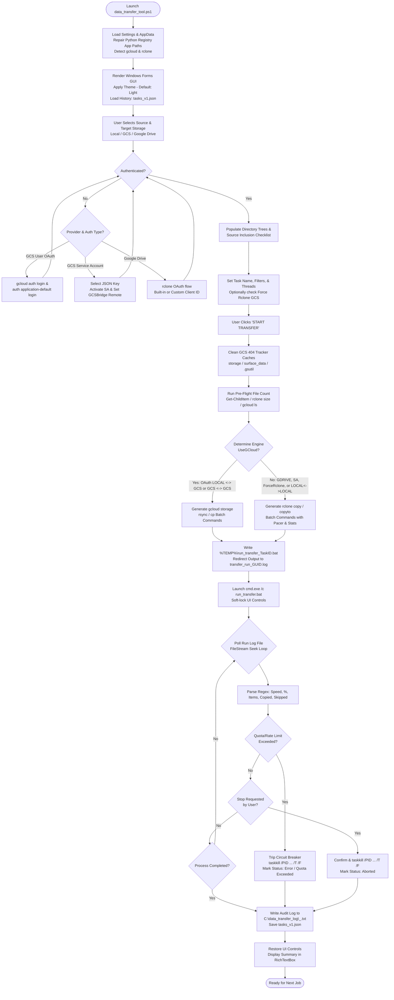

# Data Transfer Tool (`data_transfer_tool.ps1`)

> **NOAA Scientific Product Disclaimer**
> 
> *This repository is a scientific product and is not official communication of the National Oceanic and Atmospheric Administration, or the United States Department of Commerce. All NOAA GitHub project code is provided on an ‘as is’ basis and the user assumes responsibility for its use. Any claims against the Department of Commerce or Department of Commerce bureaus stemming from the use of this GitHub project will be governed by all applicable Federal law. Any reference to specific commercial products, processes, or services by service mark, trademark, manufacturer, or otherwise, does not constitute or imply their endorsement, recommendation or favoring by the Department of Commerce. The Department of Commerce seal and logo, or the seal and logo of a DOC bureau, shall not be used in any manner to imply endorsement of any commercial product or activity by DOC or the United States Government.*

---

## Overview

The **Data Transfer Tool** is an enterprise-grade PowerShell Windows Forms GUI application designed for reliable, high-throughput, and observable data migration across heterogeneous storage environments. It provides unified orchestration across:

* **Local Storage** (Local disks, mapped network drives, and UNC network shares)
* **Google Cloud Storage (GCS)** (Standard/multi-region buckets, project-managed or direct bucket access via User OAuth or Service Account keys)
* **Google Drive** (Personal "My Drive" and Enterprise "Shared Drives" / Team Drives via built-in or custom OAuth Client credentials)

The application dynamically routes transfer jobs between two industry-standard engines: the **Google Cloud SDK (`gcloud storage`)** engine for native Google Cloud transfers, and the **Rclone (`rclone.exe`)** engine for Google Workspace, cross-cloud bridging, and headless Service Account operations. Transfer operations execute asynchronously with full standard I/O redirection, live log streaming, active circuit breaking on API quota exhaustion, automatic GCS tracker cache cleanup, and persistent audit trail recording.

---

## 1. System Architecture & Detailed Workflow

### 1.1 Architectural Overview

```
+-----------------------------------------------------------------------------------------------+
|                                       GUI Main Thread                                         |
|  +-----------------------+   +--------------------------------------+   +-------------------+ |
|  | Task History List     |   | Source & Target Storage Browsers     |   | Live Logs & Stats | |
|  | - ListView / JSON DB  |   | - Provider Select (GCS/Drive/Local)  |   | - Syntax Color    | |
|  | - Column Sort (4 cols)|   | - Project / Bucket / Drive Pickers   |   | - Progress Bar    | |
|  | - Single Click: View  |   | - Auth Mode (User OAuth / SA .json)  |   | - Speed (KiB/MiB) | |
|  | - Double Click: Resume|   | - Granular Inclusion Checklist       |   | - Pre-flight Count| |
|  +-----------------------+   +--------------------------------------+   +-------------------+ |
|                                              ^                                     ^          |
|                                              | (Event & State Sync)                |          |
|                                              +------------------+                  |          |
+-----------------------------------------------------------------|------------------|----------+
                                                                  |                  |
                                       +--------------------------+                  |
                                       | %TEMP%\transfer_run_<GUID>.log              |
                                       | (Incremental FileStream Seek)               |
+------------------------------------------------------------------------------------+----------+
|                                  Background Execution Process                                 |
|                                                                                               |
|  +----------------------------+      Execution Routing       +-----------------------------+  |
|  | Native Cloud Engine        | <==========================> | Rclone Engine               |  |
|  | `gcloud storage rsync`     |      (Engine Selector)       | `rclone copy / copyto`      |  |
|  | `gcloud storage cp`        |  - OAuth Local <-> GCS       | - GDRIVE (My/Shared Drive)  |  |
|  | (Empty Dir .placeholder)   |  - GCS <-> GCS Native        | - GCS Service Account Key   |  |
|  +----------------------------+                              | - Force Rclone GCS Mode     |  |
|               |                                              | - GCS <-> GDRIVE Bridge     |  |
|               |                                              +-----------------------------+  |
|               +------------------------------+------------------------------+                 |
|                                              |                                                |
|                               Standard I/O Redirection & Parser                               |
|                       (Regex Metrics, Speed Calc & 403 Circuit Breaker)                       |
+-----------------------------------------------------------------------------------------------+
```

### 1.2 Step-by-Step Operational Lifecycle

1. **System Environment & Remediation (`Load-Settings`, `Set-RcloneEnvironment`, `Set-GCloudEnvironment`)**:
   * Inspects Windows Registry (`HKCU:\Software\Microsoft\Windows\CurrentVersion\App Paths\python.exe` and `python3.exe`) and removes legacy default overrides to prevent conflicts with Google Cloud SDK's internal bundled Python environment (`platform\bundledpython\python.exe`).
   * Loads persistent configuration from `%APPDATA%\DataTransferTool\settings.json` (defaults to Light Mode, 3 threads, User OAuth, etc.).
   * Resolves binary paths for `rclone.exe` and `gcloud.cmd` by inspecting user-defined settings, application directory (`$PSScriptRoot`), and system `PATH`.
   * Generates or updates `%APPDATA%\DataTransferTool\rclone_persistent.conf` containing the auto-configured `[GCSBridge]` remote (`type = google cloud storage`, `env_auth = true`, `bucket_policy_only = true`) and appends `service_account_file` if a Service Account key is active.
   * Loads task execution history from `%APPDATA%\DataTransferTool\tasks_v1.json`.

2. **Storage Exploration & Multi-Tier Discovery (`Update-Directory`, `Get-CloudItems`, `Is-Filtered`)**:
   * As users switch storage providers or navigate directory hierarchies, `Update-Directory` queries the chosen endpoint:
     * **Local**: Uses .NET / PowerShell file system APIs (`Get-ChildItem -Force`).
     * **Google Cloud Storage (GCS)**:
       * *Primary*: Executes `rclone lsjson` via `[GCSBridge]` for direct bucket-level access (works seamlessly with both User OAuth and Service Accounts without project-wide permissions).
       * *Fallback 1*: Executes `gcloud.cmd storage ls "gs://<bucket>/<path>*"` via `Execute-Cli-Result`.
       * *Fallback 2*: Executes `gcloud.cmd storage objects list --prefix="..." --format=json(name,updated)`.
       * *Fallback 3*: Executes legacy `gsutil ls` and `gsutil ls -r`.
     * **Google Drive**: Invokes `rclone lsjson "<remote>:<path>" --fast-list --drive-use-trash=false --drive-skip-shortcuts --drive-list-chunk=1000` via `Execute-Cli-Json`. For Shared Drives, binds `--drive-team-drive=<team_drive_id>` directly.
   * Applies the exclusion filter engine (`Is-Filtered`), hiding system files (e.g., `desktop.ini`, `thumbs.db`, `$RECYCLE.BIN`, `System Volume Information`) and user-defined custom globs.
   * Populates the Source **"Include" Checklist (`CheckedListBox`)**, enabling granular item-by-item selection before initiating transfers.

3. **Transfer Job Planning & Pre-Flight Calculation (`$BtnUpload.Add_Click`)**:
   * Verifies required input paths, buckets, and task names.
   * Automatically performs GCS 404 cache cleanup, removing stale tracker directories from `%APPDATA%\gcloud\storage`, `%APPDATA%\gcloud\surface_data\storage`, and `%USERPROFILE%\.gsutil` (`tracker-files`, `tracker_files`, `rsync`, `parallel_composite_uploads`) to avoid resume/sync conflicts.
   * Calculates the exact pre-flight item count across selected inclusion items using `Get-ChildItem` (Local), `rclone size --json` (Rclone GCS), or `gcloud storage ls` (Google Cloud SDK).
   * Determines the optimal execution engine (`UseGCloud` calculation):
     * **Google Cloud SDK (`gcloud storage`)**: Used when transfer is `LOCAL <-> GCS` or `GCS <-> GCS`, `ForceRcloneGcs` is `$false`, and `GcsAuthType` is `UserOAuth`.
     * **Rclone (`rclone.exe`)**: Used when transfer involves `GDRIVE`, `LOCAL <-> LOCAL`, `GCS <-> GDRIVE`, when `ForceRcloneGcs` is `$true`, or when `GcsAuthType` is `ServiceAccount`.
   * Creates empty directory `.placeholder` files for Local -> GCS uploads to ensure directory trees are fully replicated in cloud object storage.

4. **Batch Execution & Asynchronous Process Monitoring**:
   * Generates a self-contained execution batch file at `%TEMP%\run_transfer_<taskId>.bat` with UTF-8 encoding (`chcp 65001 >nul`) and sets the working directory to `%TEMP%`.
   * Starts `cmd.exe /c run_transfer_<taskId>.bat` as a background process with redirected output to `%TEMP%\transfer_run_<GUID>.log`.
   * Enters a non-blocking monitoring loop using `FileStream` seeking to incrementally read and parse new output lines.
   * Soft-locks the GUI (disabling transfer inputs while keeping Stop, Logs, and UI fully responsive).

5. **Live Log Parsing & Active Circuit Breaking**:
   * Formats text into the `RichTextBox` console using contextual syntax coloring (Green = Copied, DarkGray = Skipped/Unchanged, LightCoral = Errors, Cyan = Status).
   * Parses regex metrics to update instantaneous speed (`X KiB/s`, `X MiB/s`, `X GiB/s`), overall progress bar %, and item counts.
   * **Active Circuit Breaker**: Evaluates log lines against `(?i)userRateLimitExceeded|upload limit error|quota exceeded|RATE_LIMIT_EXCEEDED|rateLimitExceeded`. Upon detection, flags `QuotaReached = $true` and automatically initiates process termination via `taskkill.exe /PID <PID> /T /F` to protect API quotas.

6. **Job Completion & Audit Trail Generation**:
   * Terminates temporary process handles and purges batch/filter files.
   * Generates a permanent audit log saved to `C:\data_transfer_log\<TaskName>_<Timestamp>.txt` containing session duration, endpoints, exit code, item metrics (Copied, Skipped, Failed, Total Processed), and full detailed logs.
   * Updates task record in `%APPDATA%\DataTransferTool\tasks_v1.json` (`Completed`, `Error`, or `Aborted`) and updates the Transfer History table.
   * Restores UI controls to ready state.

---

### 1.3 Execution Flow Diagram (Mermaid.js)



---

## 2. Configuration & Settings Reference

The application stores persistent state, configuration, and logs across several designated locations.

### 2.1 File System Storage Locations

| Path | Purpose |
| :--- | :--- |
| `%APPDATA%\DataTransferTool\settings.json` | Core application configuration (tool paths, theme, thread counts, custom filters, GCS auth mode, Service Account path, Google Drive Client credentials). |
| `%APPDATA%\DataTransferTool\tasks_v1.json` | Persistent transfer task history and execution records. |
| `%APPDATA%\DataTransferTool\rclone_persistent.conf` | Rclone configuration file defining `[GCSBridge]` and `[GWorkspaceAuth]` remotes. |
| `C:\data_transfer_log\` | Directory containing timestamped audit summaries (`<TaskName>_<Timestamp>.txt`). |
| `%TEMP%\run_transfer_<TaskID>.bat` | Batch script wrapper generated for active transfer execution. |
| `%TEMP%\transfer_run_<GUID>.log` | Active run log mirror during live transfers. |
| `%TEMP%\excludes_<GUID>.txt` | Temporary rclone exclusion filter list passed during execution. |
| `%TEMP%\unified_out_<GUID>.json` | Temporary buffer used for parsing CLI output JSON streams. |

### 2.2 Application Settings (`settings.json`)

Settings are managed via the GUI **Settings** dialog (`Show-SettingsDialog`) and persisted to `settings.json`:

| Setting Property | Type | Default Value | Description & Operational Context |
| :--- | :--- | :--- | :--- |
| `RclonePath` | `string` | `""` | Absolute file path to `rclone.exe`. If blank, the tool checks `$PSScriptRoot\rclone.exe` and system `PATH`. |
| `GCloudPath` | `string` | `""` | Directory path containing `gcloud.cmd`. If blank, the tool detects standard Google Cloud SDK install directories or system `PATH`. |
| `IsDarkMode` | `boolean` | `$false` | Controls visual theme. When `$false`, enables clean Light theme; when `$true`, enables high-contrast Dark theme (RGB 30,30,30). |
| `IsDebugMode` | `boolean` | `$false` | When enabled, passes `--verbosity=debug` to Google Cloud SDK CLI commands and outputs verbose discovery diagnostics to the log. |
| `TransferThreads` | `integer` | `3` | Parallel transfer workers (`--transfers`, `--checkers`, `--tpslimit`). Allowed range: `1` to `6`. **Recommended:** 1–3 for Google Drive to avoid HTTP 403 rate limits; 4–6 for Local-to-Local transfers. |
| `CustomFilters` | `string[]` | `DefaultFilters` | Array of glob exclusion patterns filtered during directory browsing and excluded during transfer operations. |
| `DriveClientId` | `string` | `""` | Optional custom Google Drive OAuth Client ID. If blank, uses Rclone's shared built-in credentials. |
| `DriveClientSecret` | `string` | `""` | Optional custom Google Drive OAuth Client Secret. Masked with password characters in the Settings UI with a "Show Secret" toggle. |
| `GcsAuthType` | `string` | `"UserOAuth"` | Active GCS authentication method: `"UserOAuth"` or `"ServiceAccount"`. |
| `GcsServiceAccountKeyPath` | `string` | `""` | Absolute file path to the active Google Cloud Service Account `.json` key file. |
| `ForceRcloneGcs` | `boolean` | `$false` | When `$true`, forces the Rclone engine for Local <-> GCS transfers, bypassing `gcloud storage` to eliminate token expiration/session timeouts on very long transfers. |

### 2.3 Environment Variables

| Variable | Scope | Operational Purpose |
| :--- | :--- | :--- |
| `CLOUDSDK_PYTHON` | Process | Points directly to Google Cloud SDK's bundled Python interpreter (`platform\bundledpython\python.exe`) to prevent conflicts with other Python installations on Windows. |
| `GOOGLE_APPLICATION_CREDENTIALS` | Process | Points to `%APPDATA%\gcloud\application_default_credentials.json` (for User OAuth) or the active Service Account `.json` key file, providing authentication for `gcloud` and Rclone's `[GCSBridge]` remote. |
| `Path` | Process | Augmented dynamically to append the Google Cloud SDK `bin` folder and Rclone directory if discovered outside the system path. |

### 2.4 Built-in Exclusion Filters

The tool protects system files and common temporary directories by default. Custom globs can be added, edited (by double-clicking), or removed using the **Filters** dialog (`Show-FilterDialog`):

```powershell
*\desktop.ini
*\System Volume Information\
*\Temporary Internet Files\
*\thumbs.db
\$RECYCLE.BIN\
\$SysReset\
\$Windows.~BT\
\$Windows.~WS\
\$WinREAgent\
\hiberfil.sys
\pagefile.sys
\swapfile.sys
\Windows\csc\
\Windows\debug\NtFrs*
\Windows\ntfrs\jet\
\Windows\Prefetch\
\Windows\Registration\*.crmlog
\Windows\sysvol\domain\DO_NOT_REMOVE_NtFrs_PreInstall_Directory\
\Windows\sysvol\domain\NtFrs_PreExisting___See_EventLog\
\Windows\sysvol\staging\domain\NTFRS_*
\Windows\Temp\
```

---

## 3. Data Transfer Methods & Options

The application dynamically tailors the transfer engine and command flags based on endpoints and configuration:

### 3.1 Transfer Routing Matrix

| Source Provider | Destination Provider | Active Auth / Setting | Active Engine | Command Used | Behavior & Optimization |
| :--- | :--- | :--- | :--- | :--- | :--- |
| **LOCAL** | **GCS** | User OAuth (Default) | Google Cloud SDK | `gcloud storage rsync` or `cp` | Recursive folder synchronization or single file upload. Creates `.placeholder` files for empty directories. |
| **LOCAL** | **GCS** | Service Account Key | Rclone | `rclone copy` or `copyto` | Headless bucket transfer via `[GCSBridge]`. Operates with bucket-level IAM roles without requiring project-wide permissions. |
| **LOCAL** | **GCS** | `ForceRcloneGcs = $true` | Rclone | `rclone copy` or `copyto` | Bypasses `gcloud storage` to avoid token expiration/session timeouts during large multi-hour transfers. |
| **GCS** | **LOCAL** | User OAuth (Default) | Google Cloud SDK | `gcloud storage rsync` or `cp` | High-throughput object download with parallel multi-part capabilities. |
| **GCS** | **LOCAL** | Service Account / Force Rclone | Rclone | `rclone copy` or `copyto` | Downloads objects directly using Service Account credentials or Rclone OAuth. |
| **GCS** | **GCS** | User OAuth (Default) | Google Cloud SDK | `gcloud storage rsync` or `cp` | Native bucket-to-bucket copy within Google Cloud infrastructure. |
| **GCS** | **GCS** | Service Account / Force Rclone | Rclone | `rclone copy` or `copyto` | Bucket-to-bucket copy via Rclone bridge. |
| **LOCAL** | **GDRIVE** | Built-in or Custom OAuth | Rclone | `rclone copy` or `copyto` | Uploads directory tree or single file to My Drive or Shared Drive with adaptive rate pacing (`--drive-pacer-min-sleep 50ms`). |
| **GDRIVE** | **LOCAL** | Built-in or Custom OAuth | Rclone | `rclone copy` or `copyto` | Downloads files locally, honoring folder hierarchy without pulling Google Drive trash. |
| **GDRIVE** | **GDRIVE** | Built-in or Custom OAuth | Rclone | `rclone copy` or `copyto` | Transfers data between personal drives and team drives using Google Drive API backend. |
| **LOCAL** | **LOCAL** | Any | Rclone | `rclone copy` or `copyto` | High-speed local disk-to-disk or disk-to-UNC share synchronization with multi-threading. |
| **GCS** | **GDRIVE** | ADC or Service Account | Rclone (Bridge) | `rclone copy` or `copyto` | Uses `[GCSBridge]` remote to read GCS and stream into Google Drive. |
| **GDRIVE** | **GCS** | ADC or Service Account | Rclone (Bridge) | `rclone copy` or `copyto` | Streams data directly from Google Drive into GCS buckets using application credentials. |

### 3.2 Transfer Methods & Features Explained

#### 1. Recursive Directory Synchronization (`gcloud storage rsync` / `rclone copy`)
* **When to use**: Full folder migrations, initial backups, or updating directories with changed contents.
* **Mechanism**:
  * **Google Cloud SDK**: Computes differences between local directory and GCS object prefixes. Only copies new or modified files. Exclusions are translated to regex strings (`-x '(?i)(<regex>)'`).
  * **Rclone**: Compares size and modification timestamps (or hashes). Creates empty source directories (`--create-empty-src-dirs`), applies retries (`--retries 3 --low-level-retries 3`), and reads exclusion filters from a temporary filter file (`--exclude-from`).

#### 2. Targeted Single-File Copy (`gcloud storage cp` / `rclone copyto`)
* **When to use**: Selecting individual files or double-clicking a single file in the Source browser.
* **Mechanism**: Direct copy of the specified file object to the target destination without scanning neighboring directory trees.

#### 3. Granular Selection via Inclusion Checklist
* **When to use**: Transferring only specific subfolders or files from a directory without running a full sync.
* **Mechanism**: The Source panel displays all direct children of the selected path with checkboxes. Unchecking an item omits it from the command batch or appends it to the exclude list. Check All and Uncheck All buttons provide one-click bulk selection.

#### 4. Pre-Flight File & Size Counting
* **When to use**: Automatically executed prior to every transfer.
* **Mechanism**: Performs an initial scan to determine the exact total number of items to be transferred. This powers the real-time progress bar and percentage display, providing accurate ETA and item counts (`Item(s): X out of Y`).

#### 5. Rate-Limit Pacing & Quota Throttling
* **When to use**: Any transfer targeting Google Drive or Google Workspace shared infrastructure.
* **Mechanism**: Uses `--drive-pacer-min-sleep 50ms` and constrains `--tpslimit` to match the configured thread count (default: 3). If Google API responds with HTTP 403 Rate Limit Quota Exceeded, the application intercepts the error and halts execution cleanly before tokens are blocked.

#### 6. GCS 404 Cache Auto-Cleanup
* **When to use**: Automatically executed before any transfer involving GCS.
* **Mechanism**: Purges stale tracker files in `%APPDATA%\gcloud\storage`, `%APPDATA%\gcloud\surface_data\storage`, and `%USERPROFILE%\.gsutil` (`tracker-files`, `tracker_files`, `rsync`, `parallel_composite_uploads`). This prevents 404 tracking file errors when resuming interrupted transfers or synchronizing active buckets.

---

## 4. Authentication Details

### 4.1 Google Cloud Storage (GCS)

The tool interfaces with Google Cloud Storage via `gcloud.cmd` and Rclone's `[GCSBridge]` remote.

#### Supported Authentication Methods
1. **Interactive User OAuth (`User Account (OAuth)`)**:
   * Select **User Account (OAuth)** in the Auth Method dropdown.
   * Clicking **Login/Auth** executes:
     ```powershell
     gcloud.cmd auth login
     gcloud.cmd auth application-default login
     ```
   * Completes the OAuth2 flow in the system browser and saves Application Default Credentials (ADC) at `%APPDATA%\gcloud\application_default_credentials.json`.
   * Projects are automatically discovered via `gcloud projects list --format=json`.

2. **Service Account JSON Key File (`Service Account (.json)`)**:
   * Select **Service Account (.json)** in the Auth Method dropdown on either the Source or Destination panel, or configure it via the **Settings** dialog.
   * Clicking **Select Key** opens a file picker for the `.json` key file.
   * The application:
     * Validates the key file format and extracts `client_email` and `project_id`.
     * Executes `gcloud auth activate-service-account --key-file="..."`.
     * Exports `$env:GOOGLE_APPLICATION_CREDENTIALS` and configures Rclone `service_account_file` with `bucket_policy_only = true` in `rclone_persistent.conf`.
     * Automatically populates and locks the Project dropdown with the Service Account's associated `project_id`.
     * Routes GCS directory discovery, pre-flight counts, folder creation, and data transfers directly through Rclone (`lsjson`, `size`, `copy`, `copyto`). This allows seamless operations when the Service Account is granted bucket-level IAM roles without requiring project-wide `serviceusage.services.use` permissions.
   * Clicking **Clear Key** revokes credentials and removes the key configuration.

#### Required IAM Permissions
To browse buckets and transfer data, the identity (User or Service Account) requires:
* **Bucket & Object Access**:
  * `roles/storage.objectViewer` or `roles/storage.legacyBucketReader` (Read / Download / List operations)
  * `roles/storage.objectAdmin` or `roles/storage.admin` (Upload / Sync / Delete / Folder creation operations)
* **Project Listing (Optional for User OAuth; automatic for Service Account)**:
  * `roles/viewer` or `resourcemanager.projects.get` (allows populating the Project dropdown when using User OAuth).
* **Direct Bucket Entry & Manual Override**:
  * If the account lacks project-level bucket listing permissions, simply type the bucket name into the Bucket dropdown and press **Enter** (or select **`[ No Project ID (Manual) ]`**). The tool immediately loads and renders the directory listing.

#### Sign Out & Credential Clearing (`Invoke-GlobalSignOut`)
* Clicking **Sign Out** (for User OAuth) executes `gcloud auth revoke --all --quiet` and `gcloud auth application-default revoke --quiet`, deletes `%APPDATA%\gcloud\application_default_credentials.json`, wipes SQLite credential databases (`credentials.db`, `access_tokens.db`, `legacy_credentials`), and removes environment variables.
* Clicking **Clear Key** (for Service Account) revokes the active service account and removes all stored key paths.

---

### 4.2 Google Drive

Google Drive integration is managed through Rclone using the pre-configured remote name `GWorkspaceAuth`.

#### Supported Authentication Flows
1. **Built-in Shared Credentials (Default)**:
   * Leave Client ID and Client Secret blank under **Settings**.
   * Clicking **Login/Auth** launches the standard Google OAuth2 consent screen in the browser.
   * Status displays: **`Auth (GDrive - Built-in)`**.

2. **Custom OAuth Client ID & Secret**:
   * Under **Settings**, enter your organization's `Client ID` and `Client Secret` (from Google Cloud Console -> APIs & Services -> Credentials).
   * Click **Save & Apply**, then click **Login/Auth**.
   * Status displays: **`Auth (GDrive - Custom ID)`**.

#### Drive Types Supported
1. **My Drive (Personal Storage)**:
   * Select **My Drive** in the Project/Drive dropdown. Root and subfolder directories are browsed directly.
2. **Shared Drives (Team Drives)**:
   * Select **Shared Drive** in the Project/Drive dropdown.
   * The tool queries `rclone backend drives "GWorkspaceAuth:"` to retrieve all accessible Shared Drives and their unique IDs (`DriveMap`), automatically populating the Drive selector.
   * Transfers append `--drive-team-drive=<team_drive_id>` to ensure queries target the correct organizational workspace.

#### Sign Out & Token Revocation
* Clicking **Sign Out** invokes `rclone config delete GWorkspaceAuth` and removes any remaining section tokens from `rclone_persistent.conf`.

---

## 5. GUI Features & Task Management

### 5.1 Dual-Pane Storage Browsers
* **Side-by-Side Panels**: Independent Source and Destination browsers with breadcrumb path indicators.
* **Directory Navigation**: Double-click any folder `[DIR]` to enter; double-click `.. [Go Up]` to navigate to the parent folder.
* **Sorting**: Dropdowns allow sorting by Name (A-Z, Z-A) or Date (New, Old).
* **New Folder Creation**: Create folders in Local directories, GCS buckets (via `.placeholder`), or Google Drive (via `rclone mkdir`).

### 5.2 Transfer History & Resume Workflow
* **Sortable Columns**: Click any column header (**Name**, **Status**, **Started**, **Completed**) in the Transfer History table to sort ascending or descending.
* **Read-Only Inspection**: Single-click any past task to view its parameters, endpoints, and previous execution log without modifying selections.
* **Resume / Edit Mode**: Double-click any past task marked `Error`, `Aborted`, or `Active` to load all parameters, re-establish storage connections, restore the exact inclusion checklist, and click **START TRANSFER** to resume.
* **Task Duplication**: Click **Duplicate** to clone the currently selected task with a `(Copy)` suffix for fast re-runs or variations.
* **Open Log in Notepad**: Click **Open Log in Notepad** to immediately open the persistent audit log file (`C:\data_transfer_log\<TaskName>_<Timestamp>.txt`) or the active live run log.

### 5.3 Theme Management
* **Light / Dark Mode**: Toggle between clean Light theme (default) and high-contrast Dark theme (RGB 30,30,30) via the **Dark Mode** button in the left panel. Preferences are automatically saved in `settings.json`.

---

## 6. Prerequisites & System Setup

### 6.1 System Requirements
* **Operating System**: Windows 10 / Windows 11 / Windows Server 2016+ (64-bit).
* **PowerShell**: Windows PowerShell 5.1 or PowerShell 7+ (Desktop / Core with `System.Windows.Forms` support).
* **Network**: Direct HTTPS (port 443) outbound connectivity to `*.googleapis.com`.

### 6.2 External CLI Tools

| Tool | Minimum Version | Installation & Discovery |
| :--- | :--- | :--- |
| **Google Cloud SDK (`gcloud`)** | 450.0.0+ | Download from [cloud.google.com/sdk](https://cloud.google.com/sdk). Ensure the `gcloud` command is on system `PATH` or specify its directory under GUI **Settings**. |
| **Rclone (`rclone.exe`)** | 1.60.0+ | Download from [rclone.org](https://rclone.org). Place `rclone.exe` in the script directory, on system `PATH`, or specify its path under GUI **Settings**. |

---

## 7. Usage Examples & Practical Scenarios

### 7.1 Launching the Application

#### Option A: Running from PowerShell
```powershell
# Open PowerShell (as current user or Administrator)
cd "C:\#Project\data-transfer-tool-v2\nwc-data-transfer-tool-repo"

# Launch script (unblocks execution policy if necessary)
powershell.exe -ExecutionPolicy Bypass -File .\data_transfer_tool.ps1
```

#### Option B: Running the Packaged Executable
If using the compiled binary distribution:
```cmd
.\Data_Transfer_Tool_v1.1.29.exe
```

---

### 7.2 Common Execution Scenarios

#### Scenario 1: Backing up Local Directory to a GCS Bucket
1. Set **Source Storage** to `LOCAL`. Click **Select Folder** and choose `D:\ScientificData\ModelOutputs`.
2. Inspect the **Include** checklist on the bottom left. Uncheck any temporary test folders if not needed.
3. Set **Target Storage** to `GCS`.
4. Choose your GCP Project from the dropdown (or select `[ No Project ID (Manual) ]` and type your bucket name).
5. Choose your bucket from the bucket dropdown (e.g., `nwc-climate-archive`).
6. Double-click directories in the target browser to navigate into a subfolder, or click **New Folder** to create one.
7. Enter a descriptive **Task Name** (e.g., `ModelOutputs_2026_Backup`).
8. Click **START TRANSFER**. Observe the live progress bar, speed metrics, and syntax-colored logs.

#### Scenario 2: Migrating Data from Google Drive Shared Drive to GCS
1. Set **Source Storage** to `GDRIVE`. Select `Shared Drive` in the project dropdown, then select your team drive (e.g., `Hydrology Research Team`).
2. Double-click the source folder you wish to migrate.
3. Set **Target Storage** to `GCS` and pick your destination project and bucket.
4. *Cross-Cloud Bridge Check*: If you have not generated Application Default Credentials, the tool prompts you to authorize `gcloud auth application-default login`.
5. Under **Settings**, verify `TransferThreads` is set to `2` or `3` to comply with Google Drive API quotas.
6. Click **START TRANSFER**. Rclone bridges the transfer directly between Google Drive and GCS.

#### Scenario 3: Downloading from Google Cloud Storage to Local Disk
1. Set **Source Storage** to `GCS`, select your project, bucket, and navigate to the target dataset.
2. Set **Target Storage** to `LOCAL`. Click **Select Folder** and choose destination (e.g., `E:\LocalAnalysis\InputData`).
3. Click **START TRANSFER**. The tool issues `gcloud storage rsync --recursive`, skipping identical existing files and pulling down only missing or updated files.

#### Scenario 4: Automated Ingestion via Service Account JSON Key
1. Set **Target Storage** (or Source) to `GCS`.
2. Set **Auth Method** to `Service Account (.json)` and click **Select Key** to pick your `.json` key file.
3. The project dropdown automatically locks to the Service Account's associated project ID.
4. Enter or select the destination bucket name.
5. All operations run headless via Rclone's direct GCS API bridge without requiring interactive browser logins or project-level Service Usage permissions.

#### Scenario 5: Resuming an Interrupted or Errored Transfer
1. Open the tool. The left **Transfer History** panel automatically loads past tasks from `tasks_v1.json`.
2. Find the task marked with status `Error` or `Aborted`.
3. **Double-click** the task row in the list view.
4. The tool loads the task parameters, re-establishes source and target storage connections, and restores the exact inclusion checklist.
5. Click **START TRANSFER**. The tool skips already-transferred files and resumes copying remaining items.

#### Scenario 6: Reviewing Audit Logs
1. Click **Open Log in Notepad** on the action panel, or navigate to:
   ```cmd
   explorer.exe C:\data_transfer_log
   ```
2. Open the corresponding `<TaskName>_<Timestamp>.txt` file to view the audit header, total item counts, duration, and full execution output.

---

## 8. Troubleshooting & Error Resolution

| Issue / Error Message | Root Cause | Recommended Resolution |
| :--- | :--- | :--- |
| **`Missing Application Default Credentials for cross-Cloud connection`** | Transfer between GCS and Google Drive via Rclone requires local ADC tokens. | Run `gcloud auth application-default login` in PowerShell, or let the tool launch the login prompt automatically. |
| **`403 Rate Limit Quota Exceeded` / `userRateLimitExceeded`** | Too many parallel threads requesting Google Drive API tokens simultaneously. | Open **Settings** and reduce `TransferThreads` to `2` or `3`. The tool will automatically trip its circuit breaker if quota issues occur. |
| **`403 PERMISSION_DENIED` / `serviceusage.services.use` on Service Account** | Account lacks project-level service usage permissions when using standard `gcloud`. | Use **Service Account (.json)** mode or check **Force Rclone engine for Local <-> GCS transfers** in Settings. This routes transfers through Rclone directly using bucket-level permissions. |
| **`GCS 404 Tracker File Not Found` during resumption** | Stale gcloud composite upload tracking files from previous interrupted jobs. | The tool automatically cleans tracker caches prior to transfer. If encountered manually, delete `%APPDATA%\gcloud\storage\tracker-files` and `%USERPROFILE%\.gsutil\tracker-files`. |
| **`Python not found` or `gcloud.cmd failed`** | Windows App Execution aliases for `python.exe` point to Microsoft Store stubs or missing paths. | The script automatically cleans these registry keys on startup. Ensure Google Cloud SDK is installed with the bundled Python component (`platform\bundledpython\python.exe`). |
| **GCS Project Dropdown is empty** | Account does not possess `resourcemanager.projects.get` or `roles/viewer`. | Select `[ No Project ID (Manual) ]` in the Project dropdown and enter the bucket name directly in the Bucket field. |
| **`rclone.exe is not recognized`** | Rclone binary is missing from PATH and script directory. | Place `rclone.exe` in the script directory or configure its exact path under GUI **Settings**. |
| **Google Drive token expires or fails to authenticate** | Cached OAuth token in `rclone_persistent.conf` became stale or was revoked. | Click **Sign Out** next to Google Drive, then click **Login/Auth** to perform a fresh OAuth handshake. |

---

## 9. License & Maintenance

* **Repository**: `nwc-data-transfer-tool-repo`
* **Version**: `v1.1.50`
* **Disclaimer**: NOAA Scientific Product Disclaimer applies. Refer to top notice.

